<!-- Sugeriencia: aprender a usar markdown y revisar el informe antes de enviarlo -->

# tp0

**Nombre: Andres Tomas Visciglio**

**Padron: 100118**

[Link al repositorio en GitHub](https://github.com/Andivisciglio/tp0)

## Paso 0: Entorno de Trabajo

**a. Capturas de pantalla de la ejecución del aplicativo (con y sin Valgrind).**

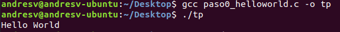

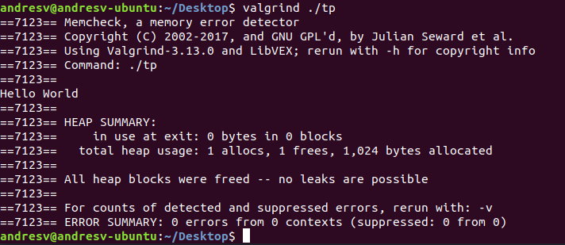

**b. ¿Para qué sirve ​ Valgrind​ ? ¿Cuáles son sus opciones más comunes?**

Valgrind es una herramienta de debugeo que sirve para realizar seguimientos en el uso de la memoria por parte del programa que queremos ejecutar. Su opcion mas comun es Memcheck pero tambien cuenta con las siguientes herramientas; Massif, Cachegrind y Helgrind.
Memcheck, el mas utilizado, sirve particularmente para detectar leaks de memoria y accesos a memoria invalidos.

**c. ¿Qué representa ​ sizeof()​ ? ¿Cuál sería el valor de salida de sizeof(char)​ y sizeof(int)​?**

Sizeof() nos indica la cantidad de bytes que ocupa en memoria el tipo recibido por parametro. Con respecto a las salidas de char e int, depende de la arquitectura que se este utilizando. Por ejemplo sizeof(int) me da un valor de 4 bytes mientras que sizeof(char) me da 1 byte ejecutado en una arquitectura de 64bits. Pero no quita que en otra arquitectura estos valores varien.

**d. ¿El ​ sizeof()​ de una struct de C es igual a la suma del sizeof()​ de cada uno sus elementos? Justifique mediante un ejemplo.**

No necesariamente. Puede pasar, pero el espacio en memoria que ocupa un struct depende no solo del tamanio de cada tipo de dato, sino que depende tambien del padding que se utilice.
Por ejemplo, si tengo un struct que solo tiene dos tipos int, entonces su sizeof() sera igual a la suma de los  sizeof() de sus elementos. Pero si tengo un struct con un char y un int, entonces el resultado del sizeof() puede ser mayor que al de la suma porque entra en juego el padding de memoria. Si se agrega la directiva __attribute__((packed)) al struct entonces podemos afirmar que siempre sera igual a la suma de los sizeof de sus miembros.

**e. Investigar la existencia de los archivos estándar: STDIN, STDOUT, STDERR. Explicar brevemente su uso y cómo redirigirlos en caso de ser necesario (caracteres > ​ y ​ < ​ ) y como conectar la salida estándar de un proceso a la entrada estándar de otro con un pipe​ (carácter
|​ ).**

Los archivos estandar STDIN, STDOUT, STDERR estan vinculados a la ejecucion de un programa y determinan distintos puntos de acceso para el mismo. Por ejemplo, el stdin es la entrada de texto hacia un programa y se puede redirigir con 'command < file'. El stdout es la salida del programa y se puede redireccionar utilizando 'command > file'. Stderr por su parte es donde se almacenan los mensajes de error y para redirigilo utilizamos 'command 2>file'. Por ultimo contamos con el comando de pipe, para conectar dos ejecuciones de programas, uniendo la salida de uno (stdout) con la entrada (stdin) del otro. Un ejemplo seria <command1> | <command2>.

<!-- Cuidado con usar '<' el markdown lo tomo como un comentario y no lo muestra en el git -->

## Paso 1: SERCOM - Errores de generación y normas de programación

**a. Captura de pantalla mostrando los problemas de estilo detectados. Explicar cada uno.**

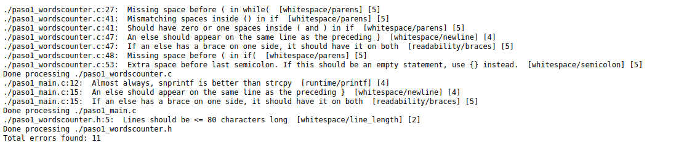

El primer error indica que falta un espaciado entre el while y el '('.
El segundo error indica que los espaciados dentro del condicional 'if' son inconcistentes. Hay dos al iniciar la sentencia y ninguno al finalizar.
El tercero nos indica como deberia ser la forma correcta relacionada al segundo error. Un espaciado simple al inicio y otro al final.
El cuarto indica que el 'else' de una sentencia 'if' debe ir en la misma linea donde termina la llave del condicional anterior, por ejemplo la forma correcta seria '}else'.
El siguiente error, relacionado al anterior nos dice que podemos optar por el formato 'else' o '}else{'. Pero que no una sola llave en la misma linea del condicional.
El sexto error nos indica que debemos dejar un espacio luego del condicional 'if'.
En la linea 53 del codigo nos marca que no debemos dejar espacios al momento de poner ';' al final de una sentencia.
Luego, el siguiente error nos indica que es conveniente usar snprintf sobre strcpy.
Ya en el documento main, vemos que se repiten el cuarto error y el quinto.
Por ultimo, se nos indica que las lineas deben tener un largo maximo de 80 caracteres.

<!-- Sugiero poner estos tipos de errores en forma de lista, con la sintaxis de markdown, que este cada definicion en una linea no quiere decir que lo muestre asi -->

**b. Captura de pantalla indicando los errores de generación del ejecutable. Explicar cada uno e indicar si se trata de errores del compilador o del linker.**

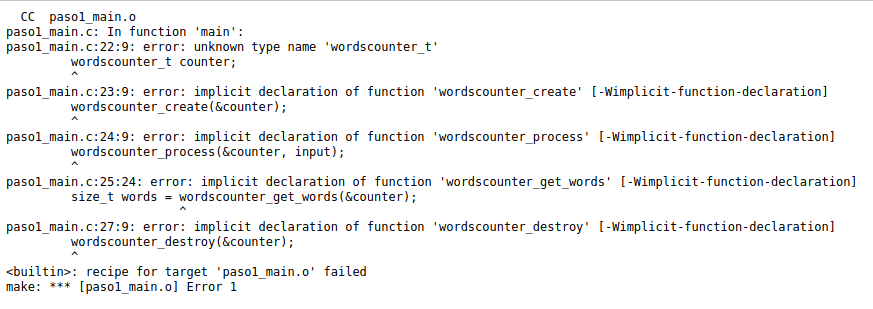

Se tratan todos de errores de compilacion.
El primer error 'unknown type wordscounter_t' sucede porque no existe una declaration del tipo entonces el compilador no sabe que tamanio tiene ni siquiera sabe si va a existir en algun lado.

Los siguientes errores son muy similares entre si. Son tres llamados a funciones que estan definidas en otro archivo y que no estan referenciadas en el archivo del main. El compilador no tiene forma de saber que esas funciones existen y ni que parametros reciben.

<!-- El error de la imagen dice claramente error de declaracion, No de definicion -->

**c. ¿El sistema reportó algún WARNING? ¿Por qué?**

El sistema no reporto ningun warning, reporto todos como errores por que se utilizo el comando Werror que toma los warnings como errores.

## Paso 2: SERCOM - Errores de generación 2

**a. Describa ​ en breves palabras​ las correcciones realizadas respecto de la versión anterior.**

Las correciones fueron principalmente de sintaxis, adecuando a lo que pedian los mensajes de error de la corrida anterior. Tambien se cambio la funcion strcpy por memcpy ya que la corrida anterior recomendaba no usarla. Tambien se incluyeron los encabezados correspondientes para hacer referencia a los archivos con las funciones

**b. Captura de pantalla indicando la correcta ejecución de verificación de normas de
programación.**

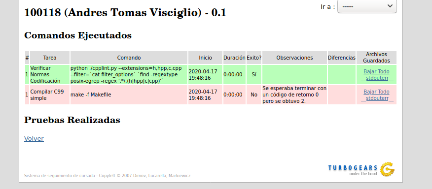

**c. Captura de pantalla indicando los errores de generación del ejecutable. Explicar cada uno e indicar si se trata de errores del compilador o del linker.**

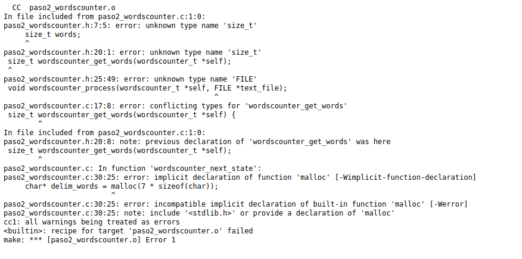

Los primeros errores sobre unknown type tanto de size_t como de FILE ocurren porque en el archivo .h no estan incluidas las librerias necesarias para utilizar esos tipos. Sin embargo, este error no ocurre en paso2_main.c. Esto se debe al orden de los includes. Al incluir ultimo el archivo paso2_worldscounter.h, toma las definiciones de los includes previos. Es por esto que rompe para un archivo .c y no para el otro. Se trata entonces de un error de compilacion ya que el compilador no tiene la informacion necesaria para crear el codigo objeto en el caso donde el orden de los includes no es el correcto.

Luego, tenemos que el error de conflicting type de wordscounter_get_words sucede debido a que fallo la declaracion en el .h previamente mencionado. Esto genera que haya una declaracion incompatible con la definicion de la funcion.

Asimismo, el error de "previous declaration" sucede por esta declaracion que fallo al no reconocer el tipo size_t lo cual nos deja dos declaraciones, una llamada por el main.c y el otro por wordscounter.c, ambas diferentes porque una fallo. Entonces aparece este error de compilacion.

El error que vemos con respecto al malloc se produce porque falta importar la liberaria correspondiente que tiene esa funcionalidad definida, por lo que es un problema de compilacion.

## Paso 3: SERCOM - Errores de generación 3

**a. Describa en breves palabras las correcciones realizadas respecto de la versión anterior.**

Se agrego la libreria que contiene malloc (stdlib) en wordscounter.c y se agregaron dos liberarias en el .h que antes faltaban.

**b. Captura de pantalla indicando los errores de generación del ejecutable. Explicar cada uno e indicar si se trata de errores del compilador o del linker.**

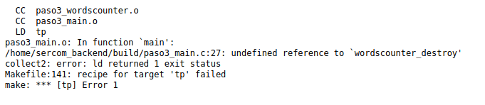

El error indicado sobre la funcion destroy "undefined reference" nos dice que el linker no puedo encontrar la definicion de esta funcion. Puedo compilar porque hay una forward declaration de la misma, pero despues no pudo linkear por no estar definida en ningun lado.

## Paso 4: SERCOM - ​ Memory Leaks y ​ Buffer Overflows

**a. Describa en breves palabras las correcciones realizadas respecto de la versión anterior.**

Con respecto a la version anterior se agrego la definicion de la funcion "destroy" que faltaba .

**b. Captura de pantalla del resultado de ejecución con Valgrind​ de la prueba ‘TDA’. Describir los errores reportados por Valgrind.**

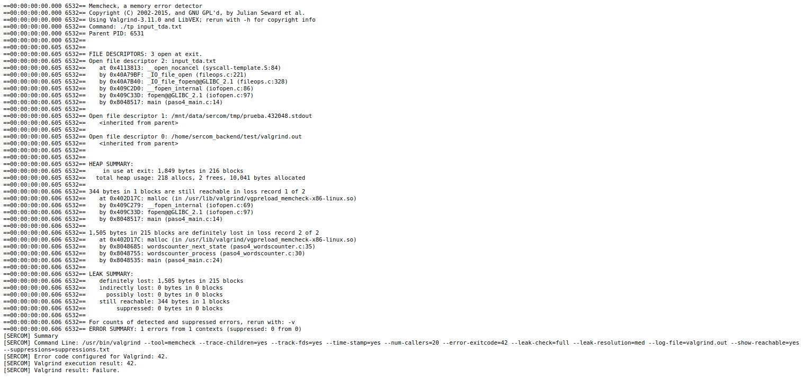

Los errores reportados por Valgrind indican que hay errores de perdida de memoria.
En primer lugar detecta que hay un pedido de memoria mediante malloc, que es llamado por fopen() y luego no es liberado causando un memory leak.
Luego, el malloc que realiza la funcion wordscounter.c tampoco es liberado al finalizar el programa, produciendo el segundo memory leak.

**c. Captura de pantalla del resultado de ejecución con Valgrind​ de la prueba ‘Long Filename’. Describir los errores reportados por Valgrind.**

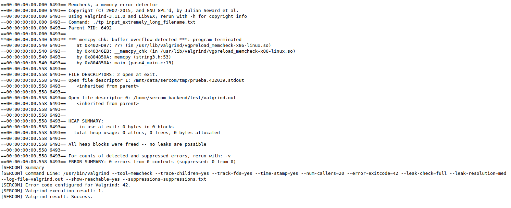

El error que podemos ver relacionado al Memcheck indica que se guardo mas informacion de la que entraba en el buffer, lo que llevo a "pisar" la memoria contigua al buffer, lo cual presenta un riesgo de fallo inminente.

**d. ¿Podría solucionarse este error utilizando la función strncpy​ ? ¿Qué hubiera ocurrido con la ejecución de la prueba?**

Si, ya que de esta forma uno puede limitar la cantidad de caracteres que se copian segun el tamanio del buffer disponible.
La prueba no hubiese tirado error si se utilizara la funcion strncpy.

**e. Explicar de qué se trata un ​segmentation fault​ y un ​ buffer overflow​.**

Segmentation Fault hace referencia a un acceso a memoria invalido, por ejemplo si queremos leer una seccion de memoria sobre la que no tenemos permiso o si queremos escribir memoria de solo lectura.
Por otro lado buffer overflow significa que nos pasamos de los limites de espacio reservado para una variable y comenzamos a escribir sobre otros espacios de memoria, con posibles consecuencias.

## Paso 5: SERCOM - Código de retorno y salida estándar

**a. Describa en breves palabras las correcciones realizadas respecto de la versión anterior.**

Se eliminio el paso intermedio en main para copiar el argumento recibido por parametro en el buffer. Ahora se pasa directo al open file.
Luego, se erradico el uso de malloc en wordscounter.c, ahora la variable esta en la memoria del stack en vez del heap.

**b. Describa el motivo por el que fallan las prueba ‘Invalid File’ y ‘Single Word’. ¿Qué información entrega SERCOM para identificar el error? Realice una captura de pantalla.**

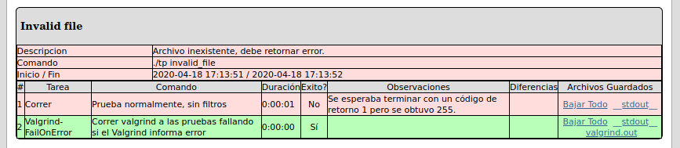

Invalid file falla porque deberia devolver error pero devuelve otro resultado. Sercom nos da esta informacion mediante la descripcion de la prueba.

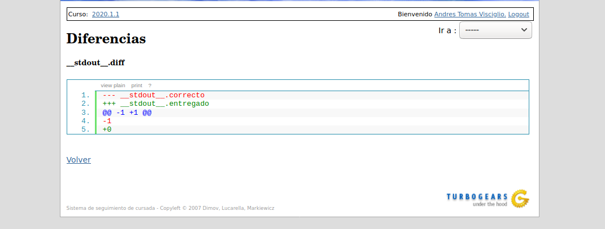

Con respecto a Single Word, este falla ya que deberia devolver -1 pero la respuesta fue 0.
Sercom nos entrega el output esperado comparado con el output recibido.

**c. Captura de pantalla de la ejecución del comando hexdump​ . ¿Cuál es el último carácter del archivo input_single_word.txt?**

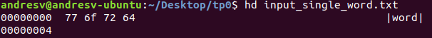

El ultimo caracter del archivo es 'd'. En ASCII 64.

<!-- Los caracteres de la izquierda representan el offset en hexadecimal del primer byte de la linea, en este caso, por ser el ultimo tambien nos dice el tamaño del archivo en bytes-->

**d. Captura de pantalla con el resultado de la ejecución con gdb​ . Explique brevemente los comandos utilizados en gdb​ . ¿Por qué motivo el debugger no se detuvo en el breakpoint de la línea 45: self->words++; ​?**

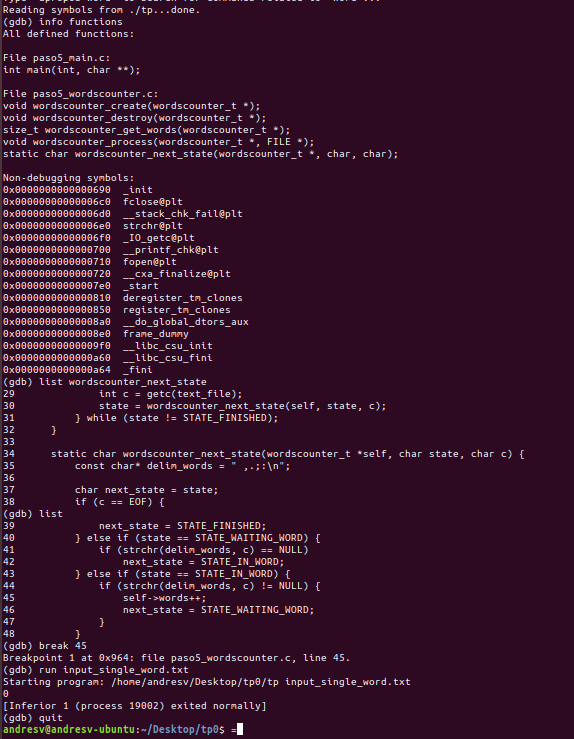

El primer comando gdb ./tp se utiliza para dar comienzo al debugeo sobre el archivo tp
info functions nos muestra todas las funciones que tiene definidas el programa.

List nos permite ver el codigo fuente del programa indicado, en un intervalo de lineas. Es por eso que tuvimos  que utilizarlo dos veces para ver todo el programa.

Break se utiliza para poner un punto de parada en el proceso de ejecucion en una determinada linea del codigo fuente. Break 45 deberia frenar el programa cuando este llegue a la linea 45.

Lo que sucede es que, como pudimos ver cocn el comando hexdump, el archivo no tiene un delimitador al final, con lo cual la ejecucion de programa nunca entra en la condicion que contiene la linea 45 con el breakpoint.

## Paso 6: SERCOM - Entrega exitosa

**a. Describa en breves palabras las correcciones realizadas respecto de la versión anterior.**

Con respecto a la version anterior, se agrego una condicion de sumar una palabra si estoy ubicado en el final del archivo.

**b. Captura de pantalla mostrando todas las entregas realizadas​ , tanto exitosas como fallidas.**

**c. Captura de pantalla mostrando la ejecución de la prueba ‘Single Word’ de forma local​ con las distintas variantes indicadas.**

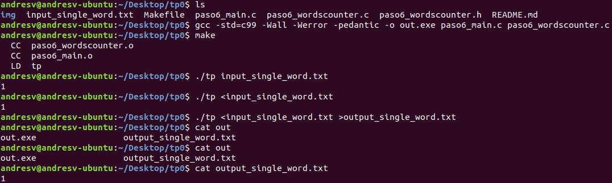
